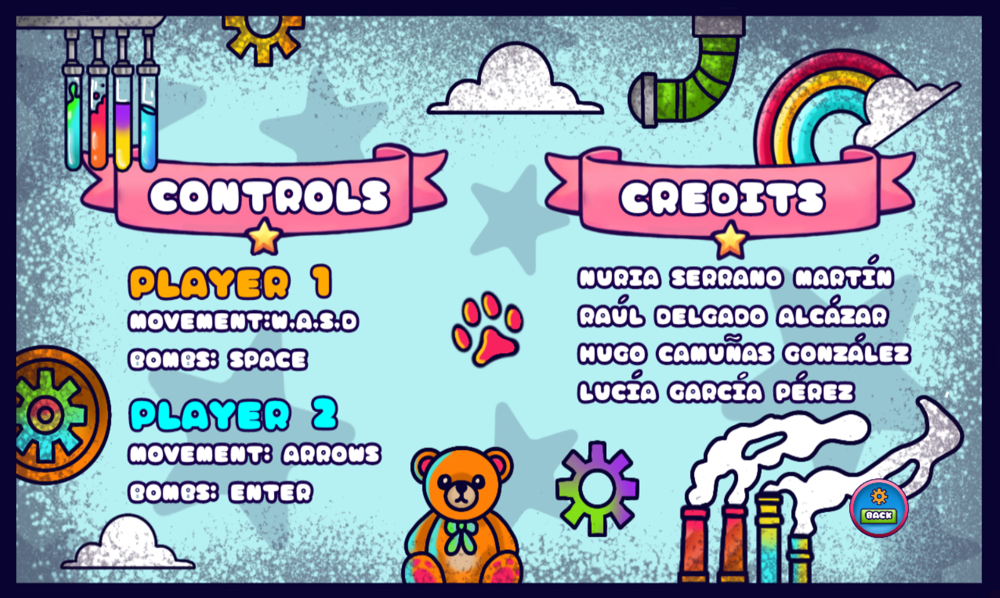
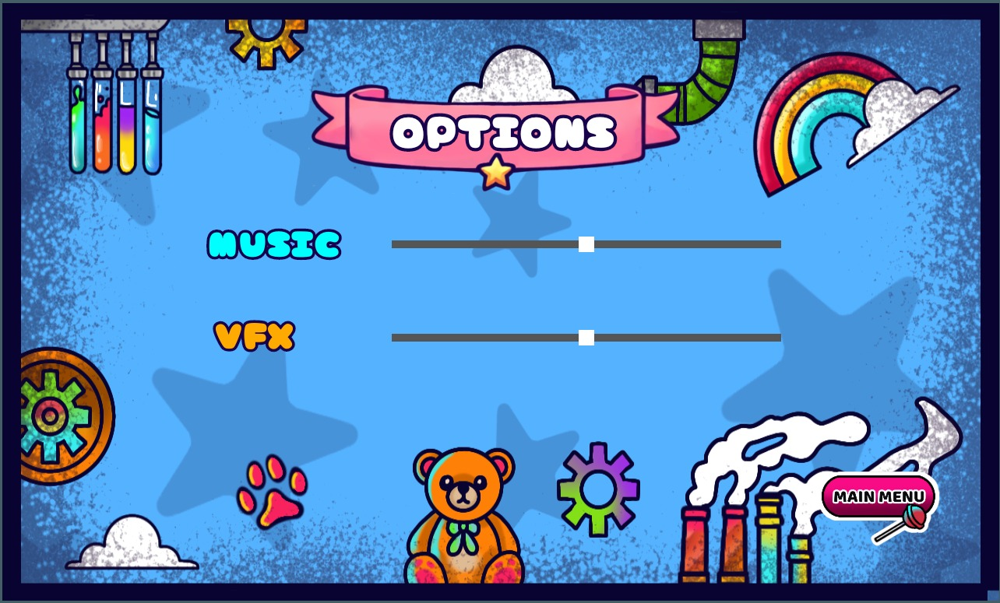
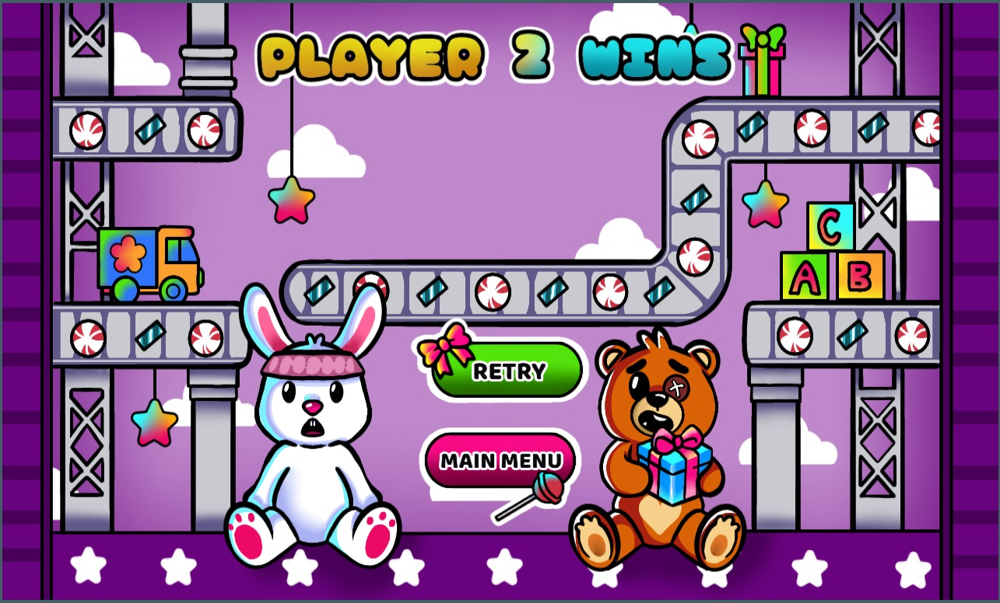
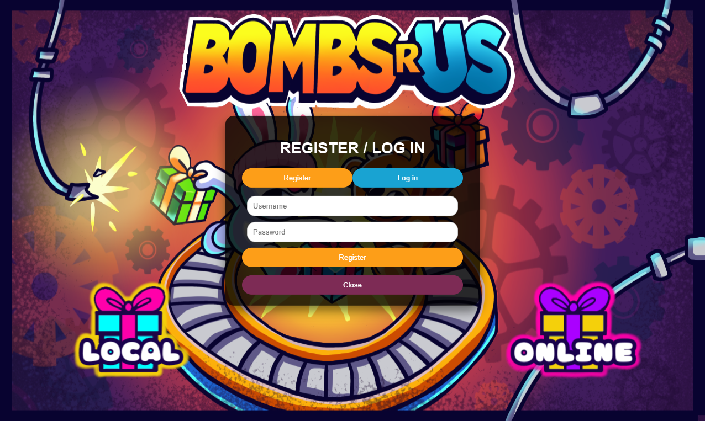
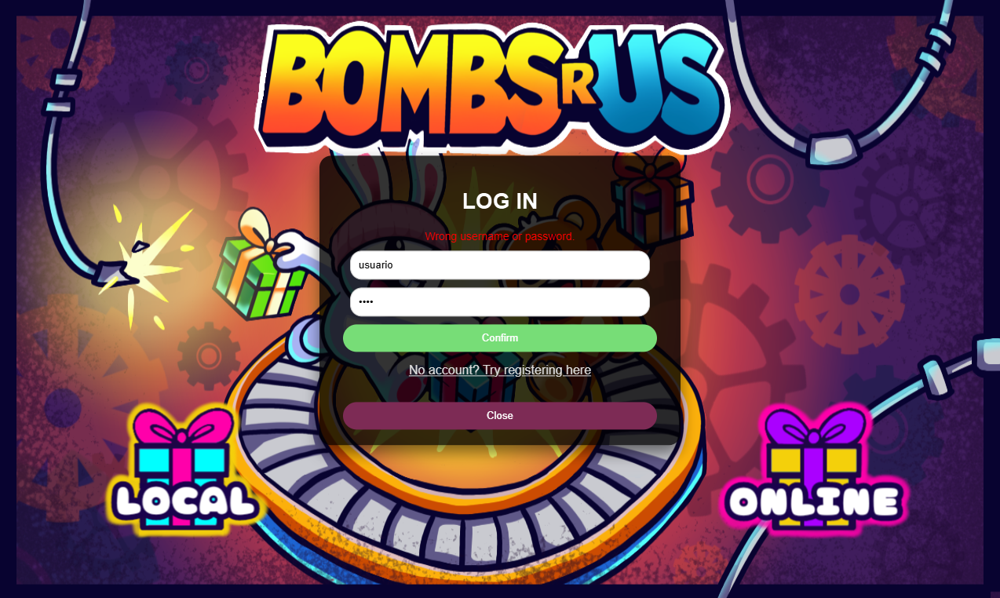

# MEJORAS FASE 5

## 1. GLITCHES Y EFICIENCIA: 

Se tuvo la suerte de no enfrentar ningún problema importante de programación durante el desarrollo del videojuego. Los únicos inconvenientes que surgieron fueron relacionados con aspectos estéticos y de jugabilidad. En lugar de problemas técnicos, nos enfocamos en perfeccionar detalles para mejorar la accesibilidad y la experiencia del usuario.

## 2. ESTÉTICA  Y DISEÑO DE ESCENARIOS:

La mejora de las interfaces, botones y demás elementos visuales se ha centrado en un estilo colorido y juvenil, pero con un toque de juego de lucha. Siempre se ha dado protagonismo a los personajes en la pantalla, destacando su rivalidad. Al comparar las interfaces originales con las mejoradas, se nota el cambio a 2D y una estética coherente en todo lo relacionado con el diseño artístico. También se añadió una nueva interfaz de pausa, que aparece cuando el juego se pone en espera (cuando uno de los jugadores pausa el juego). 

Además, se ajustaron algunos detalles visuales que antes no eran claros, como las vidas de los personajes, ya que antes no se distinguía fácilmente qué vidas pertenecían a cada uno. Por último, se ha realizado un cambio en la pestaña de "login", específicamente en el color del botón de "Aceptar". Ahora es mucho más claro si estás en la sección de registro o en la de inicio de sesión, algo que antes no se distinguía con facilidad. Estas mejoras han sido claves para notar el progreso entre cada fase del juego.

### MAIN MENU ANTES:

### MAIN MENU DESPUÉS:

### INTERFAZ CÉREDITOS ANTES:

### INTERFAZ CRÉDITOS DESPUÉS:

### ESCENARIO DE JUEGO ANTES:

### ESCENRIO DE JUEGO DESPUÉS:

### IDENTIFICADOR DE VIDAS:

### INTERFAZ DE VICTORIA ANTES:

### INTERFAZ DE VICTORIA DESPUÉS:

### INTERFAZ DE EMPATE: 

### INTERFAZ DE DERROTA:

### INTERFAZ DE PAUSA:

### INICIAR SESIÓN Y REGISTRARSE ANTES:

### INICIAR SESIÓN Y REGISTRARSE DESPUÉS:

## 3. JUGABILIDAD: 

Lo que realmente ha transformado el juego ha sido la implementación de un escenario procedural, es decir, cada vez que se juegue, los objetos y elementos del terreno se colocan de manera aleatoria en todo el mapa. Esta variabilidad del entorno le da al juego un dinamismo constante, lo que significa que no importa cuántas veces se juegue, siempre habrá algo nuevo. Esto evita que los jugadores se aburran o pierdan el interés al repetir partidas, ya que nunca se enfrentan a la misma experiencia dos veces. A pesar de esto, el diseño se ha cuidado de tal forma que no se sobrecarga visualmente el mapa, garantizando que el juego siga siendo claro en cada partida. Se implementó una mejora en la que ahora, al lado de las vidas de cada jugador, aparece su nombre. 

Además, en la pantalla final, donde se muestra quién ha ganado y quién ha perdido, también se incluye la información de con quién ha jugado cada jugador, lo que hace que sea mucho más claro el contenido del juego. Por último, ahora es posible enviar un mensaje en el chat simplemente presionando la tecla "Enter". Ya no es necesario hacerlo manualmente con el ratón haciendo clic, lo que hace que la interacción sea mucho más rápida y cómoda para el usuario.

### EJEMPLO MAPA ALEATORIO: 

