# Bombs "R" Us

Bombs "R" Us es un juego competitivo en el que dos jugadores se enfrentan dentro de una fábrica de juguetes llena de bloques y cintas transportadoras. Inspirado en Bomberman, los jugadores colocan bombas de juguete con apariencia de regalos sorpresa que explotan en confeti. El objetivo es eliminar al adversario antes de que acabe el tiempo, utilizando de manera estratégica las bombas, los portales y los elementos del entorno.  

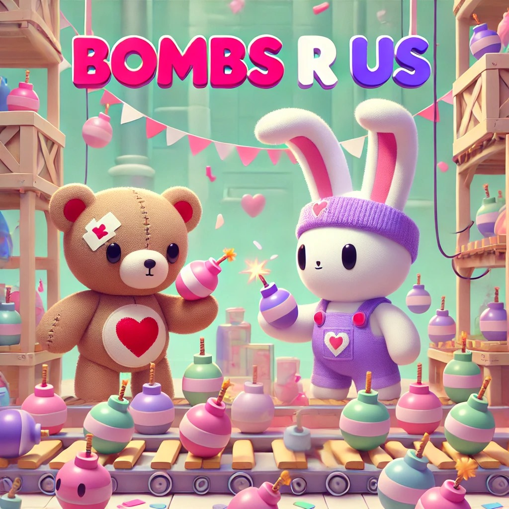

## Autores:
- **Nuria Serrano Martín**  
  - Correo: [n.serranom.2022@alumnos.urjc.es](mailto:n.serranom.2022@alumnos.urjc.es)  
  - GitHub: [nurxen](https://github.com/nurxen)

- **Raúl Delgado Alcázar**  
  - Correo: [r.delgadoal.2022@alumnos.urjc.es](mailto:r.delgadoal.2022@alumnos.urjc.es)  
  - GitHub: [raulDelgadoA](https://github.com/raulDelgadoA)

- **Hugo Camuñas González**  
  - Correo: [h.camunas.2022@alumnos.urjc.es](mailto:h.camunas.2022@alumnos.urjc.es)  
  - GitHub: [Camuuss](https://github.com/Camuuss)

- **Lucía García Pérez**  
  - Correo: [l.garciaper.2022@alumnos.urjc.es](mailto:l.garciaper.2022@alumnos.urjc.es)  
  - GitHub: [lugarpe](https://github.com/lugarpe)

# Documento de Diseño de Videojuegos

## Tabla de Contenido
1. [Cambios](#1-cambios)
2. [Introducción](#2-introducción)
   - [Concepto del juego](#21-concepto-del-juego)
   - [Características principales](#22-características-principales)
   - [Género](#23-género)
   - [Propósito y público objetivo](#24-propósito-y-público-objetivo)
   - [Jugabilidad](#25-jugabilidad)
   - [Estilo visual](#26-estilo-visual)
   - [Alcance](#27-alcance)
3. [Mecánicas de Juego](#3-mecánicas-de-juego)
   - [Jugabilidad](#31-jugabilidad)
   - [Flujo de juego](#32-flujo-de-juego)
   - [Personajes](#33-personajes)
   - [Movimiento y físicas](#34-movimiento-y-físicas)
   - [Interacción entre elementos](#35-interacción-entre-elementos)
   - [Controles](#36-controles)
4. [Interfaz](#4-interfaz)
   - [Diagrama de flujo](#41-diagrama-de-flujo)
   - [Créditos](#43-créditos)
   - [Nivel](#44-nivel)
   - [Fin de nivel](#45-fin-de-nivel)
5. [Arte](#5-arte)
   - [Estilo artístico](#51-estilo-artístico)
   - [Referencias visuales](#52-referencias-visuales)
   - [Diseño de personajes y escenarios](#53-diseño-de-personajes-y-escenarios)
   - [UI/UX](#54-uiux)
   - [Logo del juego](#55-logo-del-juego)
6. [Audio](#6-audio)
   - [Estilo musical](#61-estilo-musical)
   - [Efectos de sonido](#62-efectos-de-sonido)
7. [Desarrollo](#7-desarrollo)
   - [Funciones de red](#71-funciones-de-red)
   - [Herramientas adicionales](#72-herramientas-adicionales)
8. [Referencias](#8-referencias)

---

## 1. Cambios
**Revisión 1**
- Se detallaron las mecánicas principales.
- Se incorporaron elementos visuales.
- Realización del GDD.
**Revisión 2**
- Actualización del README
- Implementación del juego local.
---

## 2. Introducción
Este documento describe el concepto, las características y los aspectos técnicos y visuales de Bombs "R" Us, un videojuego para PC inspirado en el clásico Bomberman. Ambientado en una fábrica de juguetes, este juego competitivo para dos jugadores combina acción y estrategia en un entorno dinámico y destructible, donde los jugadores deben utilizar bombas y elementos del escenario para eliminar a su oponente. A lo largo de esta sección se describen las principales mecánicas, el género del juego, y el público objetivo. 

### 2.1 Concepto del juego
Bombs "R" Us es un juego competitivo en el que dos jugadores se enfrentan dentro de una fábrica de juguetes. Inspirado en Bomberman, los jugadores colocan bombas con apariencia de regalos sorpresa que explotan en confeti. El objetivo es eliminar al adversario  posicionándote y utilizando de manera estratégica las bombas.

### 2.2 Características principales
-	Juego competitivo de 2 jugadores en un entorno dinámico.
-	Mapa con cintas transportadoras y portales que afectan la movilidad y la estrategia (POR IMPLEMNETAR).
-	Bombas con diferentes tipos de explosiones (en cruz y cuadradas que atraviesan paredes),(EN CRUZ POR IMPLEMENTAR).
-	Fase de muerte súbita tras 2 minutos, con aparición de bombas aleatorias (POR IMPLEMNETAR).
-	Power-ups para cambiar el tipo de bomba (POR IMPLEMNETAR). 

### 2.3 Género
Pertenece al género acción-estrategia, con multijugador.

### 2.4 Propósito y público objetivo
El propósito es ofrecer una experiencia divertida y accesible, capturando la esencia de juegos clásicos como Bomberman, con una estética moderna y un enfoque en la competencia rápida. El público objetivo incluye:
- Jugadores casuales y fans de los juegos clásicos que disfruten de partidas rápidas y estratégicas.
- Niños y adolescentes atraídos por el ambiente de fábrica de juguetes y el diseño colorido y no violento.
- Jugadores que disfruten de la competencia local en PC, con un enfoque en la interacción cara a cara.

### 2.5 Jugabilidad
La jugabilidad se basa en la colocación estratégica de bombas para eliminar al adversario. Los jugadores podrán desplazarse a lo largo del escenaro que se generará aleatoriamente en cada partida, pudiendo lanzar bombas y a su vez esquivarlas de su contrincante, con el fin de perder el mínimo de vidas posibles.
En un futuro, las partidas serán rápidas y, si no hay un ganador tras 2 minutos, el juego entra en una fase de muerte súbita con bombas aleatorias que añaden urgencia.

### 2.6 Estilo visual
El juego tendrá un estilo 2D en PixelArt, excepto las interfaces en estilo cartoon; con una paleta de colores vivos que le dará un aspecto amigable. Los personajes, elementos del entorno y las explosiones estarán diseñados con detalles pixelados. La fábrica de juguetes estará representada con elementos decorativos.

### 2.7 Alcance
El alcance está orientado a proporcionar una experiencia de juego local multijugador, con partidas rápidas y rejugables. Las mecánicas son fáciles de aprender, lo que permite que jugadores de todas las edades y niveles de habilidad puedan disfrutar del juego.

---

## 3. Mecánicas de juego
El juego será de tipo competitivo entre dos jugadores. Cada jugador tendrá un objetivo claro: eliminar al oponente mediante el uso de bombas, aprovechando elementos del entorno. La victoria se puede obtener quitando al adversiaro sus correspondientres tres vidas antes de que finalicen los 2 minutos.

### 3.1 Jugabilidad
#### Portales
En un fututo cada partida contará con un máximo de un portal que aparecerá de manera aleatoria en el mapa, sirviendo como un punto de teletransporte. Los jugadores podrán usar el portal para moverse rápidamente de un extremo del tablero al otro, lo que puede ser crucial para evadir explosiones o posicionarse mejor en el campo de juego.

#### Regalos (Bombas)
Habrá dos tipos de bombas disponibles como posibles power-ups, representadas como "regalos" sorpresa:
- Una bomba que explota en forma de cruz, afectando a las casillas adyacentes en línea recta (POR IMPLEMNETAR).
- Otra bomba que genera una explosión en forma expansiva, capaz de atravesar paredes, esta podrá ser usada de dos maneras: siendo lanzadas por el jugador, o siendo colococadas en la posición del jugador (esta opción hace que las bombas exploten tras un periodo de tiempo mayor).

Las bombas no solo se usarán para atacar directamente al rival, sino también para manipular su movimiento, forzándolo a moverse a posiciones desventajosas o atrapándolo en el tablero.

#### Cintas transportadoras
Se implementarán en un futuro cintas transportadoras que moverán automáticamente tanto a los jugadores como a las bombas colocadas sobre ellas.

### 3.2 Flujo de juego
Cada partida comenzará con los jugadores posicionados en extremos opuestos del tablero. Durante los primeros 2 minutos, los jugadores podrán moverse libremente y colocar bombas. Si después de los 2 minutos no hay un vencedor, el juego entrará en una fase de muerte súbita.

### 3.3 Personajes
Cada jugador controlará a un personaje que utiliza bombas con apariencia de regalos sorpresa que explotan en confeti. Aunque los personajes son iguales en apariencia y habilidades, lo que los diferenciará será la estrategia que cada uno utilice en el tablero.

### 3.4 Movimiento y físicas
Los jugadores se moverán utilizando las teclas W, A, S y D, o las flechas del teclado respectivamente, pudiendo lanzar las bombas con la tecla "Espacio", si el jugador usa las letras, y "Enter" si usa las flechas.

### 3.5 Interacción entre elementos
- **Bombas**: Los jugadores solo pueden colocar una bomba a la vez. Las bombas colocadas por el jugador afectarán al oponente si este se encuentra en su radio de explosión, quitandoloe así una de sus vidas.
- **Portales**: Cuando un jugador entra en un portal, aparecerá inmediatamente en la salida del otro portal (POR IMPLEMNETAR).
- **Cintas transportadoras**: Los jugadores que se paren sobre una cinta transportadora se moverán automáticamente en la dirección de la cinta. Esto también afectará a las bombas colocadas en la cinta, lo que puede cambiar las estrategias de colocación (POR IMPLEMNETAR).

### 3.6 Controles
- **Movimiento**: Se realiza utilizando las teclas W, A, S, D para moverse en las direcciones correspondientes (adelante, izquierda, atrás, derecha) o las flechas del teclado respectivamente.
- **Colocar bombas**: Los jugadores usarán la tecla "Espacio" o "Enter" para tirar bombas o colocarlas, dependiendo de si el personaje esta en movimiento o no.
- **Power-ups**: Los power-ups que permitirán cambiar el tipo de bomba (en cruz o cuadrada) se recogerán automáticamente al tocarlos. Una vez obtenidos, el jugador podrá alternar entre los dos tipos de bombas hasta que utilice el power-up.

---

## 4. Interfaz

### 4.1 Diagrama de flujo
El diagrama de flujo de la interfaz del juego sigue una estructura simple entre las diferentes pantallas y menús. Las transiciones son las siguientes:

- **Menú de inicio**: Desde aquí, los jugadores pueden iniciar una nueva partida o ver los créditos del juego.
- **Menú de opciones/pausa**: Permite ajustar configuraciones del juego o pausar la partida actual.
- **Pantalla de juego**: Después de seleccionar la opción de comenzar la partida, el jugador es llevado directamente al tablero de juego donde se desarrolla la acción.
- **Pantalla de victoria/derrota**: Al finalizar la partida, dependiendo del resultado (ganador o perdedor), el jugador es redirigido a una pantalla que muestra el resultado de la partida y les ofrece la opción de volver al menú principal.

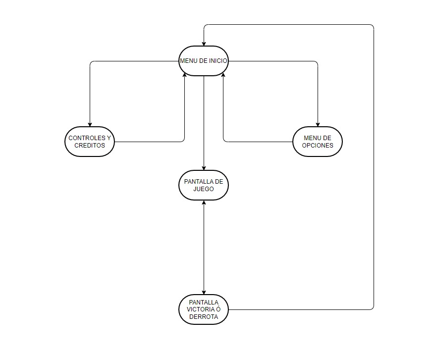
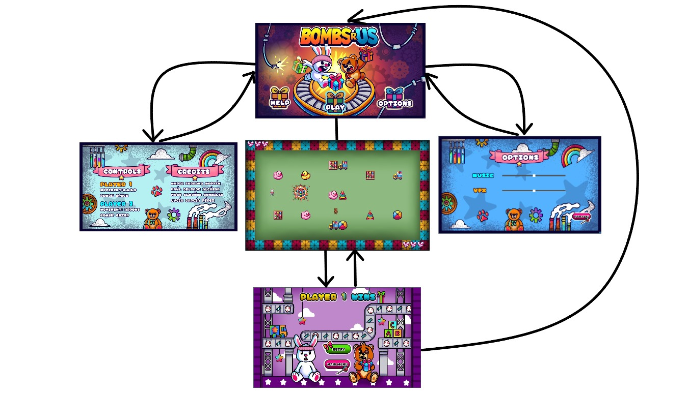

### 4.3 Créditos
En la interfaz de "HELP", se muestra a los desarrolladores del juego:
- Nuria Serrano Martín
- Raúl Delgado Alcázar
- Hugo Camuñas González
- Lucía García Pérez

### 4.4 Nivel
En un futuro al iniciar el juego, se presenta un mapa lleno de obstáculos, donde algunos bloques son rompibles y otros no. En el mapa, también hay dos cintas transportadoras que añaden dinamismo. El diseño del nivel fomenta la estrategia, obligando a los jugadores a usar el entorno a su favor para superar a su oponente.

### 4.5 Fin de nivel
Una vez que termina la partida, se muestra la pantalla de victoria o empate de cada jugador indivual, dependiendo del resultado. 

- **Pantalla de victoria**: Una vez uno de los jugadores ganan se muestra una interfaz ya sea: "player 1 wins", "player 2 wins" o "draw", dependiendo del resultado final de la partida.

Desde esta pantalla, los jugadores tendrán la opción de regresar al menú principal para iniciar una nueva partida o salir del juego.

---

## 5. Arte

### 5.1 Estilo artístico
El estilo artístico será **PixelArt** en 2D con una paleta de colores vivos a excepción de las interfcaes, que serán estilo cartoon.

### 5.2 Referencias visuales
Las principales influencias visuales para este proyecto provienen de títulos como **Reventure**, **Stardew Valley** y **Katana Zero**. Estos juegos han servido como inspiración tanto en el estilo artístico como en la paleta de colores para desarrollar la estética de *Bombs "R" Us*.

### 5.3 Diseño de personajes y escenarios

**Personajes:** Serán diseñados en estilo **PixelArt**. Los personajes estarán inspirados en la estética infantil y de juguetes, con un aspecto caricaturesco y colores pastel. Algunos personajes serán:

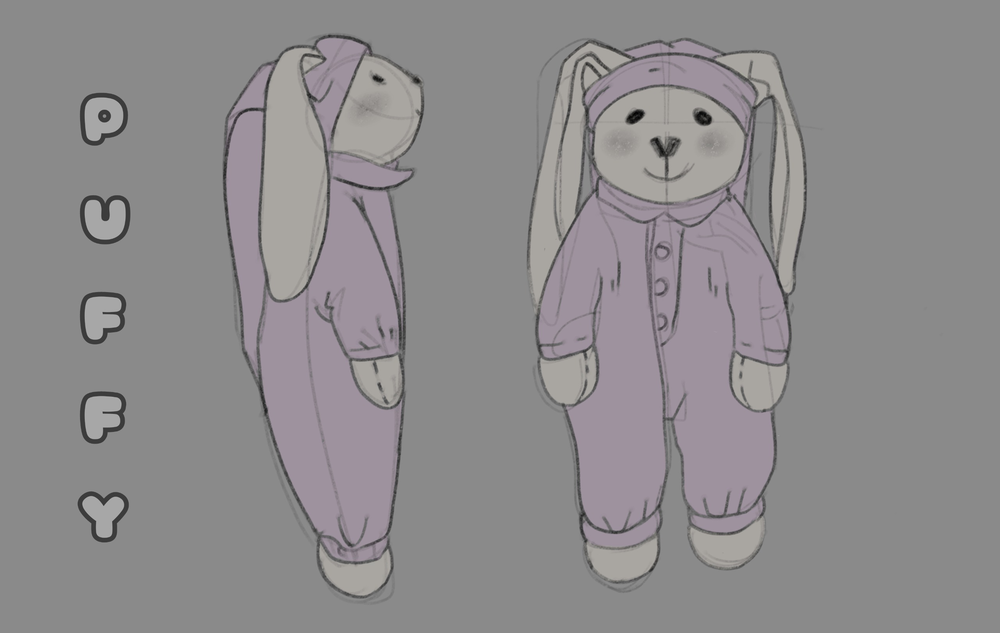
- **Puffy:** Un conejo de peluche blanco con pijama rosa.

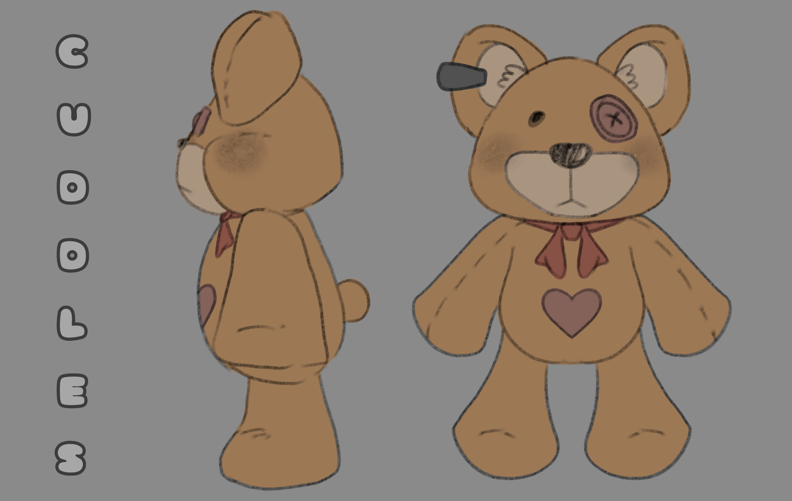
- **Cuddles:** Un oso marrón con un lazo rojo.

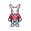

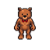
-  **Spritesheet personajes**
**Regalos (bombas):**  

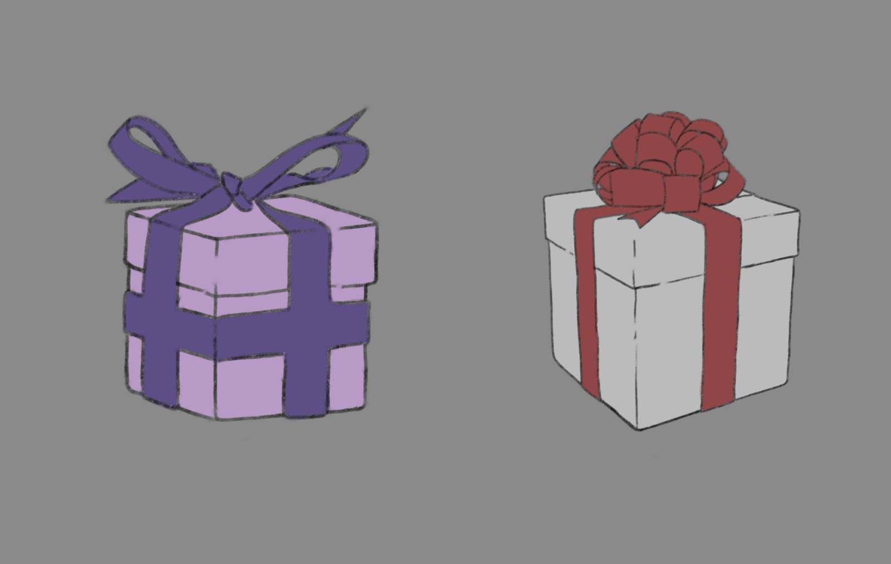
- **Bomba en cruz:**  
- **Bomba en área:**
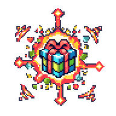
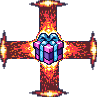
  - **Regalos explosión final:**

- **Escenarios:** El tablero representará una **fábrica de juguetes** y detalles industriales.
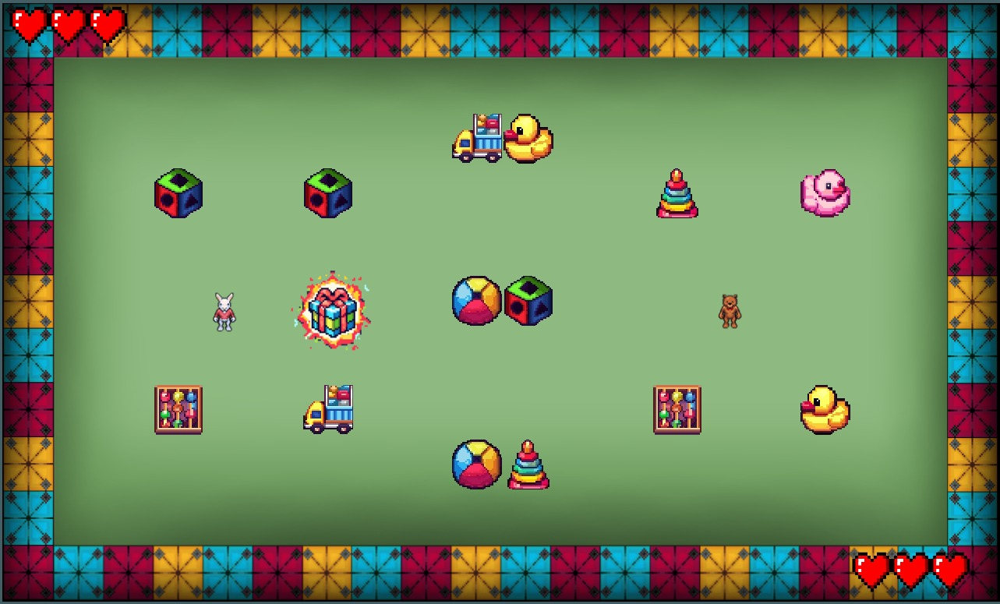

- **Decoración/obstáculos:**
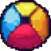
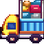
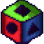
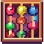

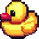

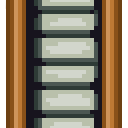
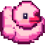
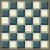
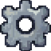

### 5.4 UI/UX
La interfaz de usuario será ** clara y visualmente atractiva**, diseñada para no distraer al jugador de la acción principal.

- **Menús:** Los menús serán fáciles de navegar, con botones grandes.
- **Indicadores visuales:** La decoración estará bien diferenciada con colores llamativos y claros, asegurando que los jugadores puedan identificar los objetos rápidamente.

- **Interfaces iniciales**

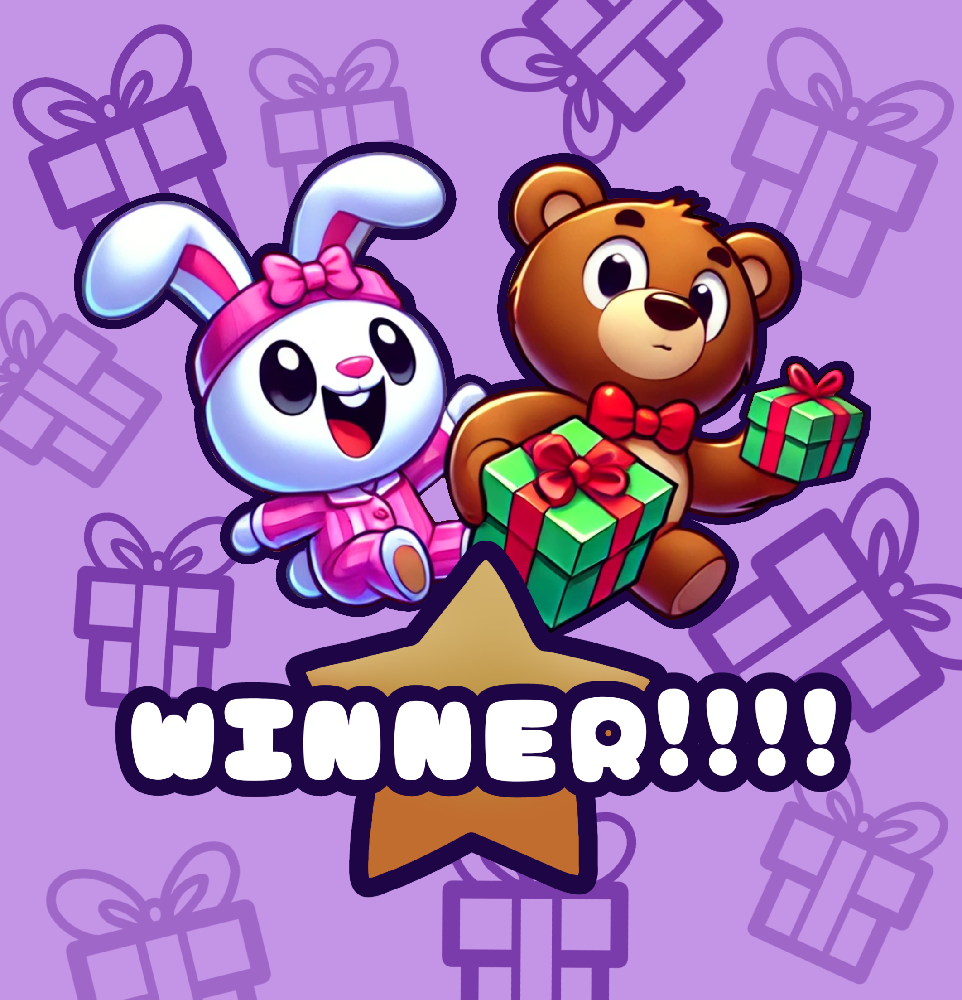

- **Interfaces finales**
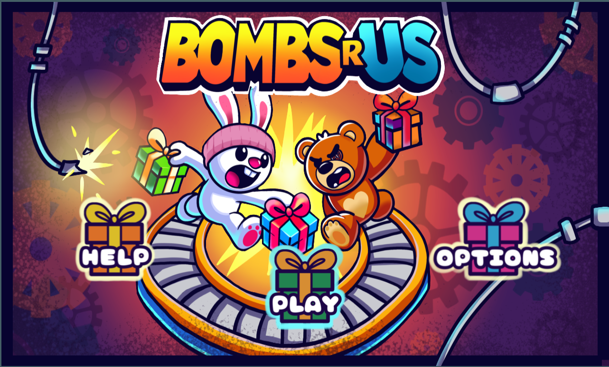
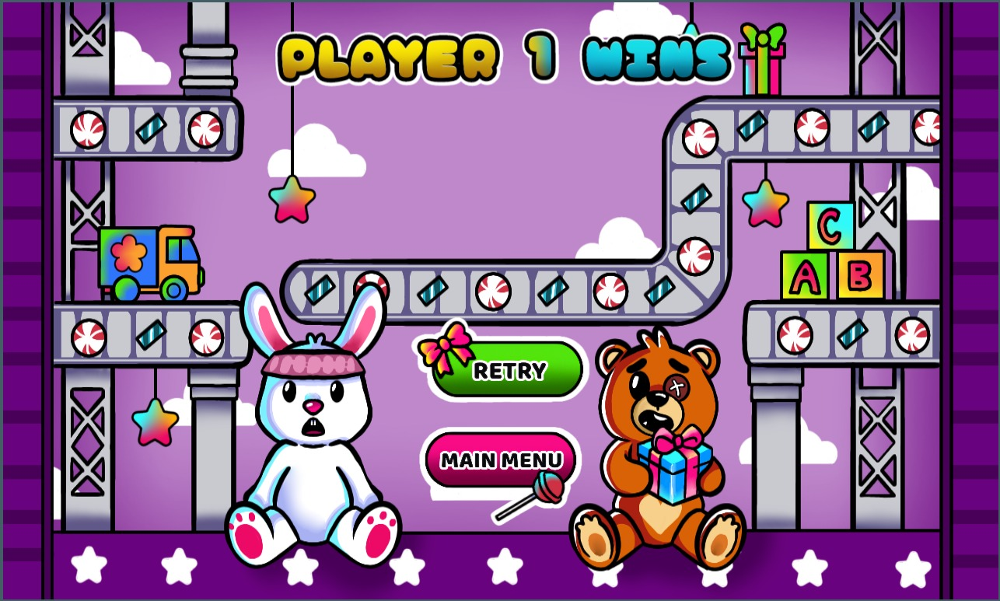
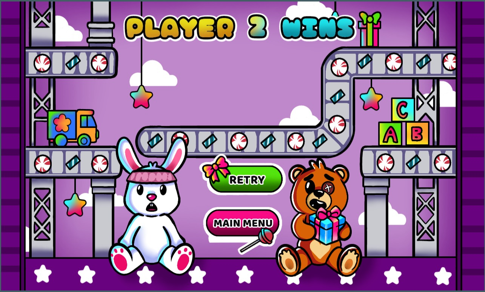

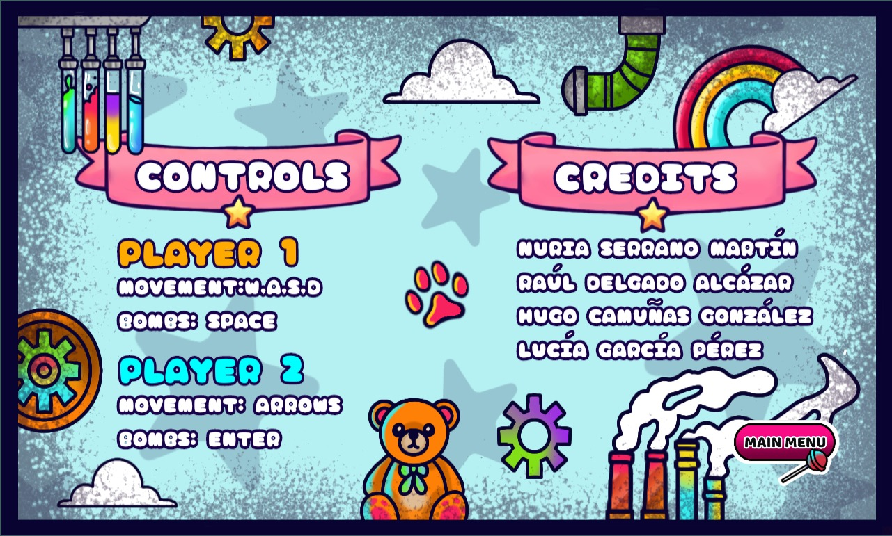

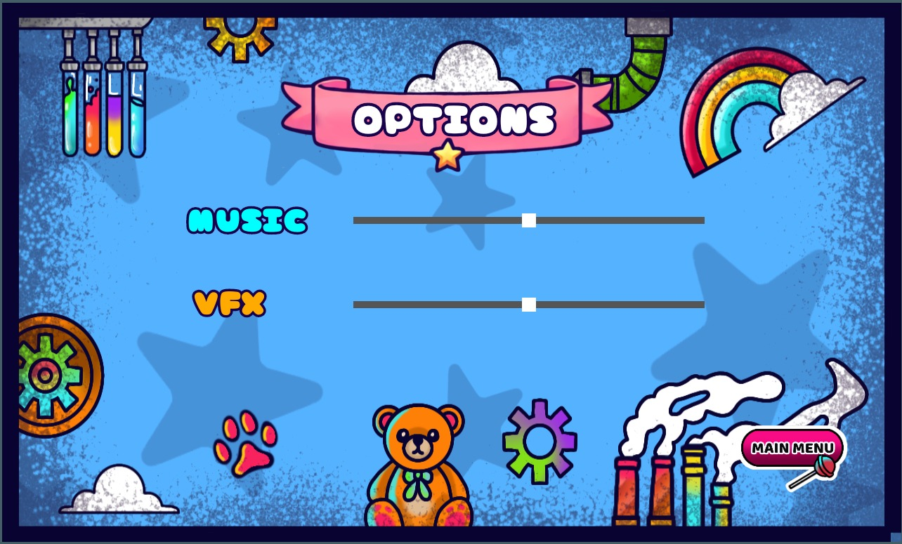
### 5.5 Logo del juego
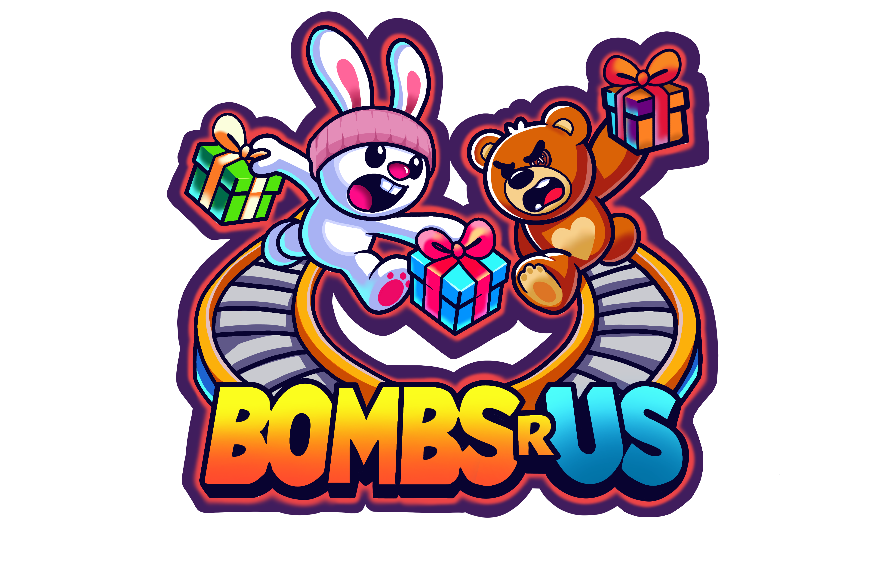

---

## 6. Audio

### 6.1 Estilo musical
La música es **enérgica**, adaptándose a la acción del juego para mantener a los jugadores comprometidos y entretenidos durante las partidas.

### 6.2 Efectos de sonido
- **Ambiente:** Sonido de fábrica, incluyendo el ruido de las cintas transportadoras en movimiento (POR IMPLEMENTAR).
- **Bombas:** Sonido similar a un globo siendo colocado cuando se posicionan en el tablero (POR IMPLEMENTAR).
- **Explosiones:** Efectos de sonido de confeti estallando para acompañar las explosiones de las bombas sorpresa.

---

## 7. Desarrollo

El juego se desarrollará utilizando **Spring Boot** para la parte del servidor y **Phaser 3** para el cliente, garantizando una estructura escalable y adaptable para el juego.

### 7.1 Funciones de red

Las funciones de red son esenciales para garantizar la interacción en tiempo real entre los jugadores y el servidor. Las principales funciones de red incluirán:

- **Conexión de jugadores:** El servidor gestionará la conexión de dos jugadores, permitiendo que se unan a la partida y estableciendo un juego en tiempo real.
- **Sincronización de estado:** Se implementarán mecanismos para sincronizar el estado del juego entre el servidor y los clientes, asegurando que todas las acciones (como movimientos de personajes y explosiones) se reflejen instantáneamente en todos los dispositivos de los jugadores.
- **Comunicación en tiempo real:** Utilizando **WebSockets**, el servidor podrá enviar y recibir datos para garantizar que las interacciones entre los jugadores sean rápidas y fluidas.
- **Gestión de partidas:** El servidor se encargará de gestionar el ciclo de vida de las partidas, desde la creación hasta la finalización, permitiendo a los jugadores unirse, salir y ser emparejados de forma dinámica.

### 7.2 Herramientas adicionales

El desarrollo gráfico y sonoro del juego utilizará las siguientes herramientas:
- **Aseprite:** Para la creación y animación de gráficos en **PixelArt**.
- **Photoshop:** Para la edición gráfica avanzada de recursos.
- **FL Studio:** Para la creación y edición de la música y efectos de sonido del juego.

---

## 8. Referencias

Todo el contenido utilizado en este proyecto ha sido obtenido bajo la **licencia Creative Commons 0 (CC0)**.

